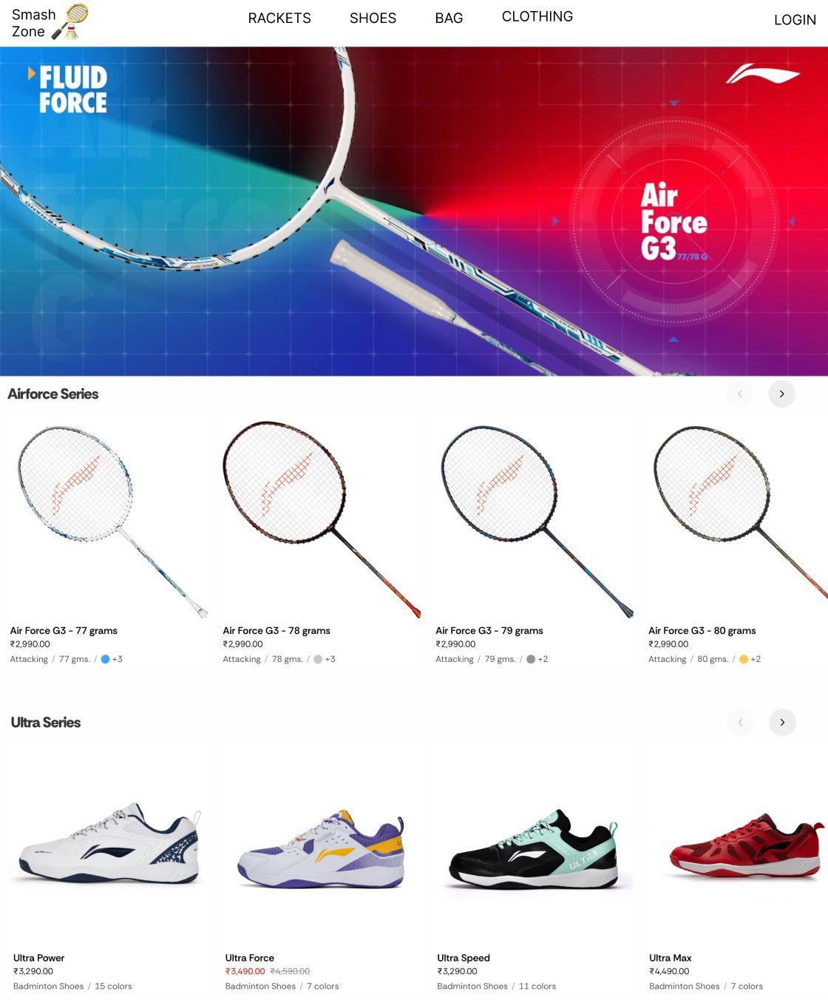

# SmashZone

[SmashZone](https://smashzone.anandamarwan.com) simple e-commerce

Table of Contents:

- [SmashZone](#smashzone)
  - [Links](#links)
  - [Features](#features)
  - [UI Designs](#ui-designs)
    - [Home Page](#home-page)
  - [Entity Relationship Diagram (ERD)](#entity-relationship-diagram-erd)
  - [REST API Endpoints](#rest-api-endpoints)
    - [Product](#product)
    - [Add New Product](#add-new-product)

## Links

- Website/Frontend: <https://smashzone.anandamarwan.com>
  - Backend: <https://smashzone-api.anandamarwan.com>
- Repositories:
  - General: <https://github.com/anandamarwan/smashzone>
  - Backend: <https://github.com/anandamarwan/smashzone-api>
  - Frontend: <https://github.com/anandamarwan/smashzone-web>

Inspirations:

- <https://www.yonex.com/>
- <https://in.lining.studio/>

## Features

- Home page
  - Hero section
  - Products catalogue. Example: <https://in.lining.studio/product/3d-calibar-x-drive>
- Product page
  - Image
  - SKU (stock keeping unit)
  - Name
  - Price
  - Add to cart form: quantity input & add to cart button
- Shopping cart page
  - Product items to buy
    - Image, name, price, quantity, total (price x quantity)
    - Remove item
  - Link: continue shopping, go to products catalogue
  - Link: checkout
- Checkout page
  - Order summary
    - Product items to buy
    - Grand total of all product items to buy
- Place order / transaction is being processed

## UI Designs

- Figma: <https://www.figma.com/design/gvTBZobMsbDGVjtJEkYumA/smashzone.anandamarwan.com?node-id=1-2&t=Bpw7oNv3ov1ucVSP-0>

### Home Page



## Entity Relationship Diagram (ERD)

## REST API Endpoints

- Production: `https://smashzone.anandamarwan.com`
- Local: `http://localhost:3000`

| Endpoint         | HTTP     | Description               |
| ---------------- | -------- | ------------------------- |
| `/products`      | `GET`    | Get all products          |
| `/products/:id`  | `GET`    | Get product by id         |
| `/products/seed` | `POST`   | Seed all initial products |
| `/products`      | `POST`   | Add new product           |
| `/products`      | `DELETE` | Delete all products       |
| `/products/:id`  | `DELETE` | Delete product by id      |
| `/products/:id`  | `PUT`    | Update product by id      |

### Product

```json
{
  "id": "abc123",
  "name": "aeronaut 9000",
  "price": 480000
}
```

### Add New Product

Request Body:

```json
{
  "name": "aeronaut 9000",
  "price": 480000
}
```

Response Body:

```json
{
  "id": "abc123",
  "name": "aeronaut 9000",
  "price": 480000
}
```
